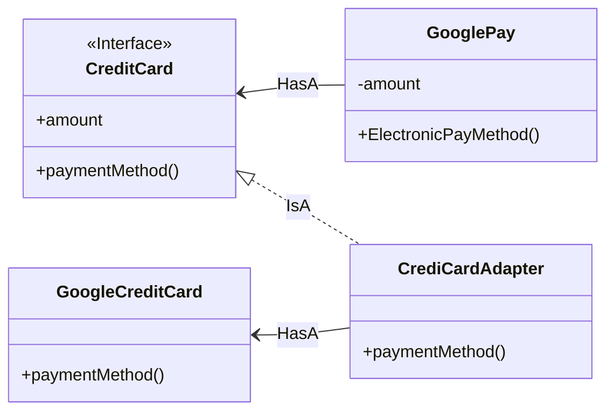

```mermaid
classDiagram
    direction LR
    class GooglePay{
        -amount
        +ElectronicPayMethod()
    }

    class CreditCard{
        <<Interface>>
        +amount
        +paymentMethod()
    }


    class CrediCardAdapter{
        +paymentMethod()
    }

    class GoogleCreditCard{
        +paymentMethod()
    }

    CreditCard <-- GooglePay : HasA
    CreditCard <|.. CrediCardAdapter : IsA
    GoogleCreditCard <-- CrediCardAdapter : HasA
```