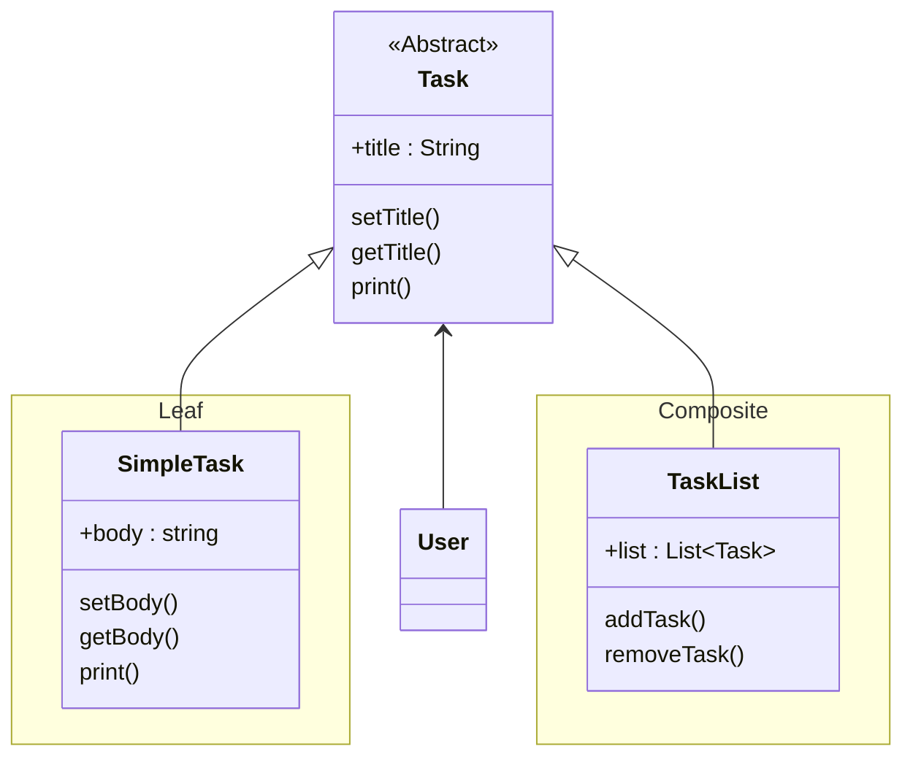

```mermaid
classDiagram
class User

class Task{
    <<Abstract>>
    +title : String
    setTitle()
    getTitle()
    print()
}
namespace Leaf{

class SimpleTask{
    +body : string
    setBody()
    getBody()
    print()
}
}
namespace Composite{

class TaskList{
    +list : List~Task~
    addTask()
    removeTask()
}
}

Task <-- User
Task <|-- SimpleTask
Task <|-- TaskList
```
