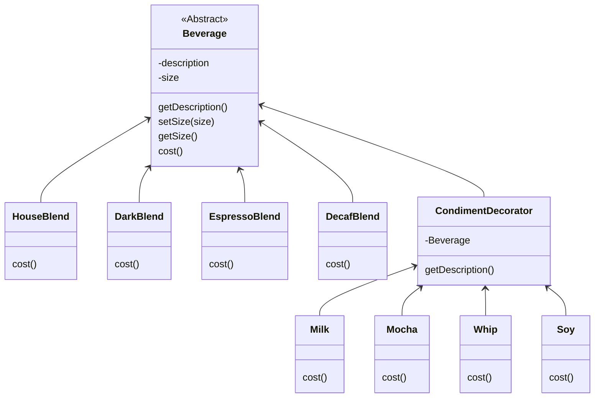

```mermaid
classDiagram
    direction TD
    class Beverage{
        -description
        -size
        getDescription()
        setSize(size)
        getSize()
        cost()
    }
    <<Abstract>> Beverage

    class HouseBlend{
        cost()
    }
    class DarkBlend{
        cost()
    }
    class EspressoBlend{
        cost()
    }
    class DecafBlend{
        cost()
    }

    class CondimentDecorator{
        -Beverage
        getDescription()
    }

    class Milk{
        cost()
    }
    class Whip{
        cost()
    }
    class Mocha{
        cost()
    }
    class Soy{
        cost()
    }

    Beverage <-- DarkBlend
    Beverage <-- HouseBlend
    Beverage <-- EspressoBlend
    Beverage <-- DecafBlend

    Beverage <-- CondimentDecorator

    CondimentDecorator <-- Milk
    CondimentDecorator <-- Mocha
    CondimentDecorator <-- Whip
    CondimentDecorator <-- Soy
```
