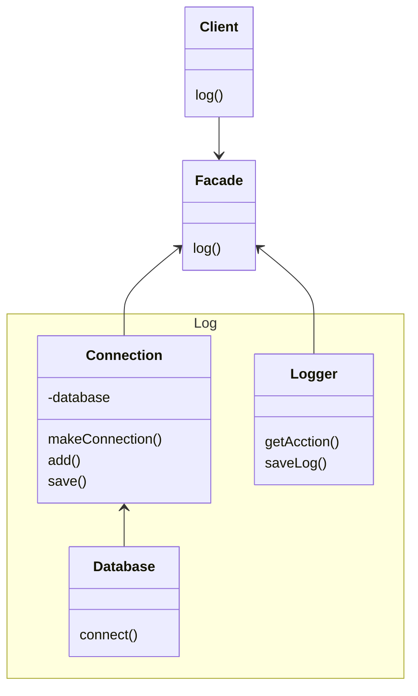

```mermaid
classDiagram
direction TD
class Client{
    log()
}
class Facade{
    log()
}
namespace Log{
    class Connection{
        -database
        makeConnection()
        add()
        save()
    }
    class Logger{
        getAcction()
        saveLog()
    }
    class Database{
        connect()
    }
}
Connection <-- Database
Facade <-- Connection
Facade <-- Logger
Client --> Facade
```