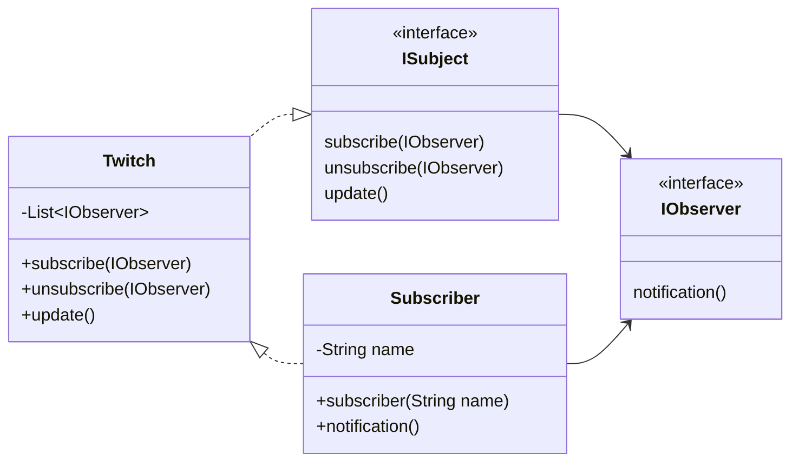

```mermaid
classDiagram
  direction RL
    class IObserver
    <<interface>> IObserver
    IObserver : notification()
    class ISubject{
        subscribe(IObserver)
        unsubscribe(IObserver)
        update()
    }
    <<interface>> ISubject
    class Subscriber{
        -String name
        +subscriber(String name)
        +notification()
    }
    class Twitch{
        -List~IObserver~
        +subscribe(IObserver)
        +unsubscribe(IObserver)
        +update()
    }
    IObserver <-- ISubject
    IObserver <-- Subscriber
    ISubject <|.. Twitch
    Subscriber ..|> Twitch
```
