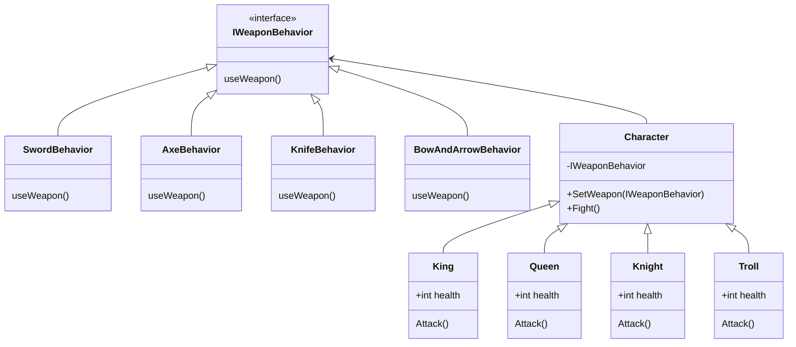

```mermaid
classDiagram
    direction TD
    class IWeaponBehavior
    <<interface>> IWeaponBehavior
    IWeaponBehavior : useWeapon()
    class SwordBehavior{
        useWeapon()
    }
    class AxeBehavior{
        useWeapon()
    }
    class KnifeBehavior{
        useWeapon()
    }
    class BowAndArrowBehavior{
        useWeapon()
    }
    IWeaponBehavior <|-- SwordBehavior
    IWeaponBehavior <|-- AxeBehavior
    IWeaponBehavior <|-- KnifeBehavior
    IWeaponBehavior <|-- BowAndArrowBehavior

    class Character{
        -IWeaponBehavior
        +SetWeapon(IWeaponBehavior)
        +Fight()
    }

    class King{
        +int health
        Attack()
    }
    class Queen{
        +int health
        Attack()
    }
    class Knight{
        +int health
        Attack()
    }
    class Troll{
        +int health
        Attack()
    }
    Character <|-- King
    Character <|-- Queen
    Character <|-- Knight
    Character <|-- Troll

    IWeaponBehavior <-- Character
```
