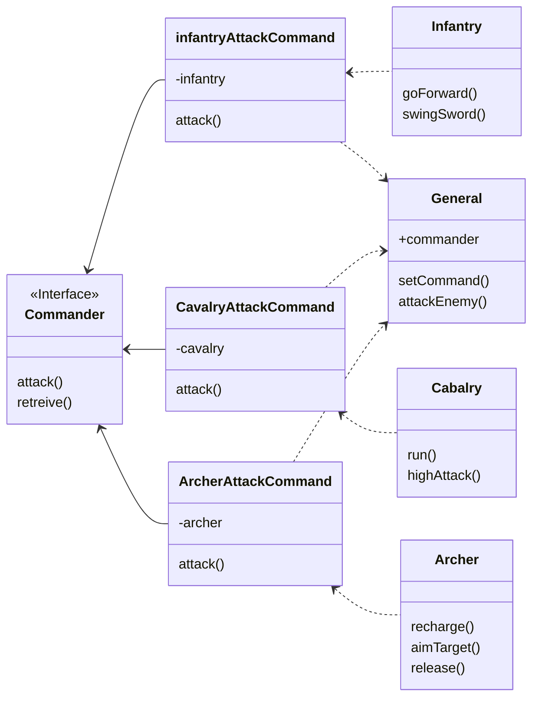

```mermaid
classDiagram
    direction LR
    class Commander{
        attack()
        retreive()
    }
    <<Interface>> Commander

    class infantryAttackCommand{
        -infantry
        attack()
    }
    class CavalryAttackCommand{
        -cavalry
        attack()
    }
    class ArcherAttackCommand{
        -archer
        attack()
    }

    Commander <-- infantryAttackCommand
    Commander <-- CavalryAttackCommand
    Commander <-- ArcherAttackCommand
     
    class General{
        +commander
        setCommand()
        attackEnemy()
    }

    class Infantry{
        goForward()
        swingSword()
    }
    class Cabalry{
        run()
        highAttack()
    }
    class Archer{
        recharge()
        aimTarget()
        release()
    }

    infantryAttackCommand <.. Infantry
    CavalryAttackCommand <.. Cabalry
    ArcherAttackCommand <.. Archer

    infantryAttackCommand ..> General
    CavalryAttackCommand ..> General 
    ArcherAttackCommand ..> General 

```